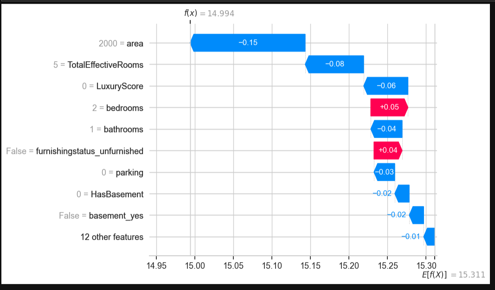
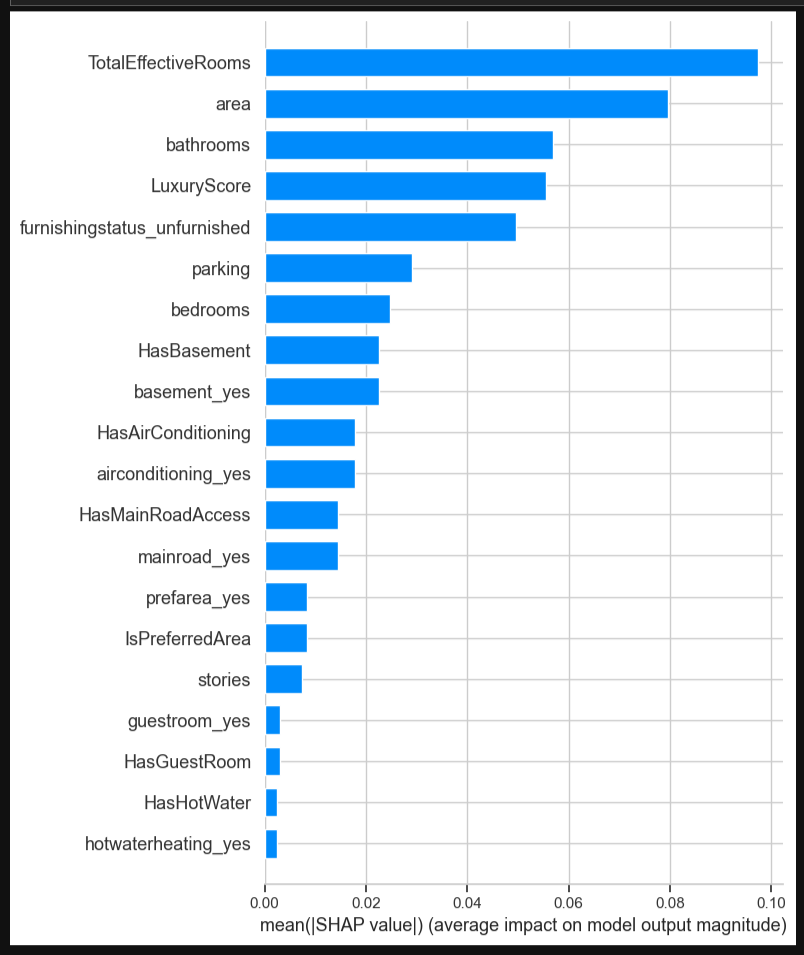

# Ames Housing Price Prediction 

A machine learning project using Ridge Regression to predict housing prices based on simplified housing features.

## Project Highlights
- Custom feature engineering (`LuxuryScore`, `TotalEffectiveRooms`)
- Exploratory data analysis & visualization
- Model comparison: Linear, Ridge, Random Forest, XGBoost
- Ridge Regression chosen for optimal performance & generalization

## Directory Structure


## How to Run
1. Install dependencies  
   `pip install -r requirements.txt`  
2. Open the notebook and follow along!  

## Results
| Model             | RMSE | R²    |
|------------------|------|-------|
| Ridge Regression  | 0.25 | 0.672 |

## Author
Built by Dartayous ✨ | AI Engineer & Visual FX Alchemist

---

## 3. Create `requirements.txt`

You can auto-generate it like this:

```python
!pip freeze > requirements.txt

## Model Explainability (SHAP)

Below is a SHAP waterfall plot showing how the Ridge Regression model made its prediction for a specific home (Index #16):



This visual highlights the base value, the positive and negative feature contributions, and the final log-price prediction—illustrating interpretability at the individual prediction level.

## Global Model Explainability (SHAP Summary Plot)

Below is a SHAP bar-style summary plot showing the **average impact of each feature on model predictions** across the test set:



This visual summarizes which features most heavily influence the Ridge Regression model’s output, averaged over many predictions. High-impact features (positive or negative) reflect consistent influence, not just isolated cases.
